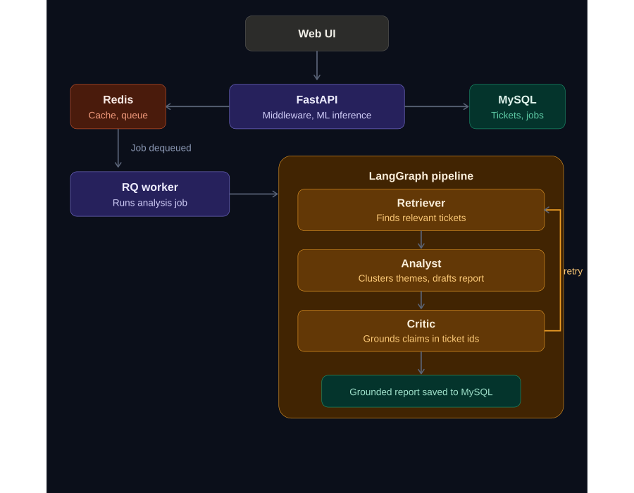

# Triagent — AI Agent System for Support Ticket Triage

Support teams waste hours manually triaging tickets. Triagent automatically classifies incoming tickets with ML, routes risky ones to a human review queue, and uses a LangGraph multi-agent pipeline to generate grounded analysis reports on demand — behind a production-style backend with caching, rate limiting, and an async job queue.

## Architecture



The `/analyze` endpoint returns a `job_id` in milliseconds; the heavy agent work runs in a separate worker process, and the client polls `/jobs/{id}`. This is the classic async-job pattern, implemented almost entirely with plain synchronous Python functions.


## Setup (5 steps)

```bash
# 1. Start MySQL and Redis
docker compose up -d

# 2. Install dependencies
pip install -r requirements.txt

# 3. Train the ML model (use a bigger Kaggle dataset for real scores)
python -m app.ml.classifier

# 4. Load sample data
python seed_data.py
# (existing installs only: python migrate.py  -- adds status columns)

# 5. Run everything (2 terminals)
python -m uvicorn app.main:app --reload
python -m rq.cli worker analysis --worker-class rq.worker.SimpleWorker
```
Open http://localhost:8001 — the web UI is served by FastAPI itself (same origin, no CORS needed). API docs: http://localhost:8001/docs

Windows notes (skip on Mac/Linux):

--worker-class rq.worker.SimpleWorker is required — RQ's default worker uses os.fork(), which doesn't exist on Windows.
Don't use --reload on uvicorn — its subprocess reloader can break local import shims (see xxhash.py below). Restart uvicorn manually after code changes instead.
If a package's compiled dependency gets blocked by a Windows security/antivirus policy (ImportError: DLL load failed ... Application Control policy has blocked this file), see xxhash.py in the project root — it's a pure-Python stand-in that avoids this exact issue for one of LangGraph's dependencies. Same technique works for other blocked native dependencies: write a small pure-Python module with the same name, place it in the project root, Python finds it before the installed (blocked) package.

Optional: export ANTHROPIC_API_KEY=... (or set on Windows) makes the Analyst agent write reports with Claude instead of the template. The system works fully without it.

Important: use a real dataset

data/sample_tickets.csv has only 25 rows — enough to run the system, far too small for a meaningful model 

Features beyond the core pipeline

Human-in-the-loop review. ML routes risky tickets to a human instead of full automation: negative-sentiment tickets always require review, and neutral billing tickets do too (money issues are risky even when the customer sounds calm). They wait in the Review queue tab until a human marks them resolved. Interview point: this is how ML systems are actually deployed — automate the easy 80%, keep humans on the high-risk slice.

Data retention policy. Resolved tickets are deleted 7 days after resolution (cleanup_resolved), so the database doesn't grow forever. Runs at API startup and piggybacked after each analysis job; in production it would run on a scheduler (cron / rq-scheduler).

Cache invalidation on writes. Creating or resolving a ticket deletes the cached ticket lists (invalidate_ticket_cache), so reads after a write are never stale. Interview point: cache-aside for reads + invalidate-on-write is the standard answer to "how do you keep the cache consistent?"

Search. /search?q= does SQL LIKE over subject and body. Upgrade path: full-text index (MySQL FULLTEXT) or embedding-based semantic search.

Interview talking points (know these cold)

System design

Why a job queue? Agent analysis takes 10–60s; running it in the request would block a server worker and time out. The API stays fast, workers scale horizontally (rq worker × N).
Why Redis for three things? Cache (cache-aside with TTL — check source field in /tickets response to see hits), rate limiting (fixed-window INCR+EXPIRE; know its weakness: bursts at window edges; sliding window fixes it), and queue broker for RQ.
Failure handling: worker wraps jobs in try/except, status goes to failed instead of hanging forever. Jobs are idempotent — safe to retry.
Scaling answer: API is stateless → add replicas behind a load balancer; add workers for queue depth; MySQL read replicas if reads dominate.

Database

Schema: tickets / analysis_jobs / reports with a foreign key. Indexes on category and status — run EXPLAIN SELECT * FROM tickets WHERE category='billing' and show it uses idx_category.
Why raw SQL over ORM: you can explain every query and its index usage.

ML

TF-IDF + LogisticRegression baseline: fast, interpretable, a benchmark to beat.
Upgrade story: DistilBERT fine-tune → better F1, higher latency and cost. Trade-off talk beats library name-dropping.
KMeans clustering finds recurring themes; top cluster-center terms name the theme.
Semantic search: TF-IDF cosine similarity now; upgrade to sentence-transformer embeddings + FAISS because TF-IDF misses synonyms ("refund" vs "money back").

LangGraph

Why a graph, not a chain: the Critic node has a conditional edge — approve → END, reject → back to Analyst (a loop). Chains can't loop.
Critic does a grounding check: report must reference real ticket IDs, which limits hallucination.
Graceful degradation: works with or without an LLM API key.

FastAPI (sync)

Plain def endpoints run in FastAPI's threadpool — they do not block the event loop. You get validation, auto docs, and speed with zero async code. Knowing why this is safe is itself an interview point.
Roadmap (say these when asked "what would you improve?")
Fine-tuned DistilBERT classifier + HuggingFace sentiment model
Sentence-transformer embeddings with FAISS index for retrieval
Connection pooling for MySQL
Sliding-window rate limiter
Dockerize the API and worker too (full docker-compose deployment)
Auth with API keys stored in MySQL
